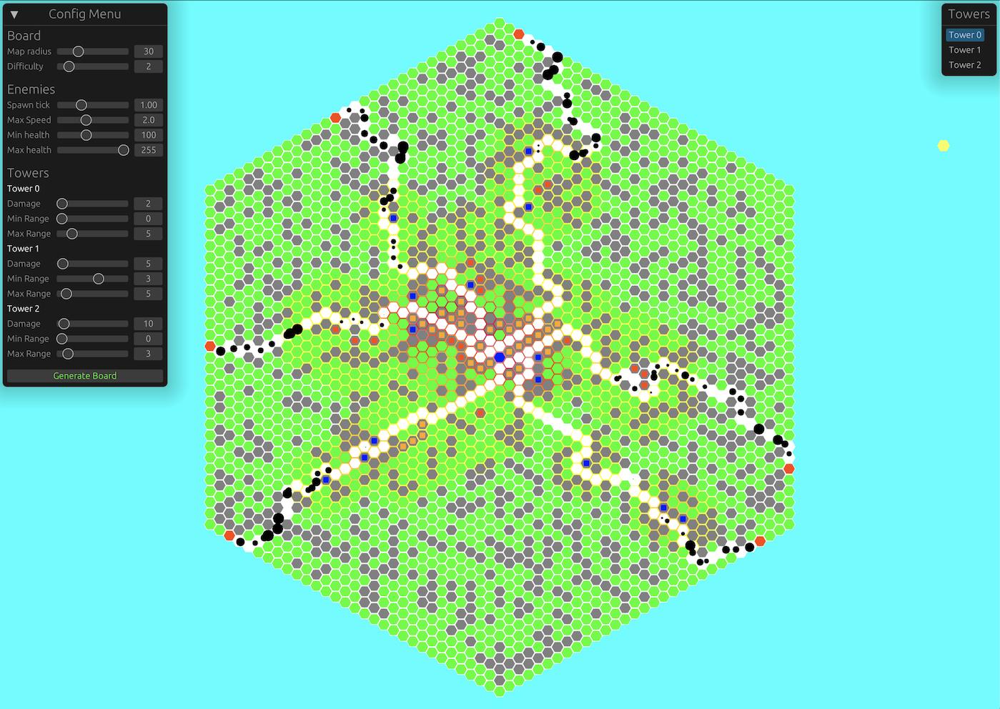

# Introduction

Hello, in this tutorial we will introduce game development in Rust using [Bevy], a free and open source data-driven game engine.

The final result of this course is a 2D *tower defense* you can test in this live version:

[Bevy]: https://bevyengine.org/
